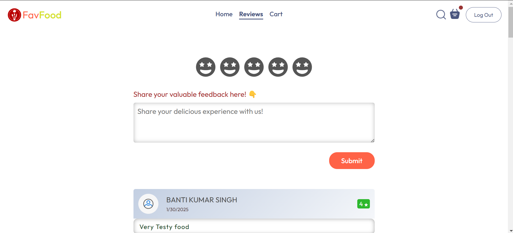

# 🍔 FavFood - Food Delivery Application

**FavFood** is a fully responsive **food delivery application** built with **React, Redux Toolkit, and React Router DOM**. This project provides an interactive and seamless user experience with essential functionalities like category-based food selection, a cart system, secure routing, and discount offers. 🚀  

---

## 🔥 Features  

✅ **Home, Review, and Cart Sections**  
✅ **Category-Based Food Selection** 🍕  
✅ **Search Functionality** 🔍  
✅ **Secure Routes for Restricted Access** 🔒  
✅ **User Ratings & Feedback System** ⭐  
✅ **Exciting Discounts!** Get a discount on orders above ₹500 🎉  
✅ **Fully Responsive UI** – Optimized for Mobile, Tablet, and Desktop 📱💻  
✅ **Smooth Navigation with React Router**  

---

## 🛠️ Tech Stack  

- **React.js** – For a modular and component-based UI  
- **Redux Toolkit** – For efficient state management  
- **React Router DOM** – For seamless navigation  
- **React Icons** – For an engaging UI experience  
- **CSS Modules** – For scoped and maintainable styling  

---

## 🎬 Demo  

🔗 **Live Project:** [[Click Here](https://food-delivery-project-fs23.vercel.app/)]  
💻 **GitHub Repository:** [[Click Here](https://github.com/BunniSingh/Food-Delivery-Project_fs23)]  

---

## 📂 Folder Structure  

```
FavFood/
│── public/ 
│── src/
│   ├── assets/           # Images & Icons
│   ├── components/
│   │   ├── Navbar/
│   │   ├── Footer/
│   │   ├── FoodDisplay/
│   │   ├── FoodItem/
│   │   ├── Cart/
│   │── pages/
│   │   ├── Home/
│   │   ├── Review/
│   │   ├── Cart/
│   ├── redux/            # Redux Toolkit Store & Slices
│   ├── App.js            # Main Component
│   ├── index.js          # Entry Point
│── package.json          # Dependencies & Scripts
│── README.md             # Documentation
```

---

## 🛠️ Installation & Setup  

1️⃣ **Clone the Repository**  
```bash
git clone [https://github.com/BunniSingh/Food-Delivery-Project_fs23]
cd FavFood
```

2️⃣ **Install Dependencies**  
```bash
npm install
```

3️⃣ **Start the Development Server**  
```bash
npm start
```

4️⃣ **Build for Production**  
```bash
npm run build
```

---

## ⚙️ Redux Store Structure  

- `foodSlice.js` - Manages food items and categories  
- `cartSlice.js` - Handles cart functionalities  
- `reviewSlice.js` - Stores user reviews and ratings  

---

## 🖥️ Key Components  

### 📌 Navbar  
- Displays brand name and navigation links  
- Shows cart icon with item count  

### 📌 Food Display  
- Lists food items based on category selection  
- Implements a **"Show More"** button  

### 📌 Cart  
- Allows users to add/remove items  
- Displays total price and applies **discount** if applicable  

### 📌 Review  
- Collects user feedback and ratings  
- Displays existing customer reviews  

---

## 📸 Screenshots  

🚀 **Homepage**  


🛒 **Cart Page**  


⭐ **Review Section**  
 

---

## 🚀 Deployment  

This project is deployed on **Vercel**. You can check it live here:  
🔗 [Click Here](https://food-delivery-project-fs23.vercel.app/)  

---

## 📢 Special Thanks  

A big shoutout to **Geekster** and **Divyansh Sir** for their mentorship and guidance throughout this project! 🚀  

---

## 📌 Future Enhancements  

✅ **Payment Gateway Integration**  
✅ **User Authentication (Login/Signup)**  
✅ **Order Tracking System**  

---

## 📝 License  

This project is **open-source** and free to use! 🎉  

---

## 🤝 Connect With Me  

🔗 LinkedIn: [Click Here](https://www.linkedin.com/in/banti-kr-singh/)

📧 Email: bantikumarsingh91@gmail.com  

💬 **Would love to hear your feedback and suggestions!** 🚀  
